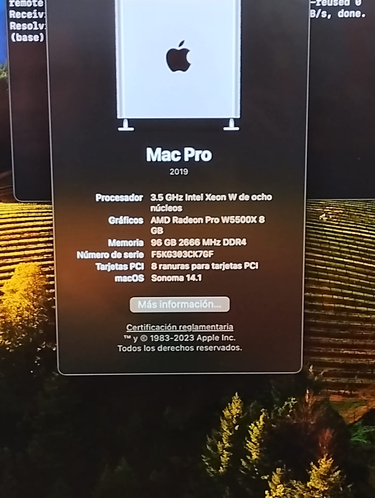
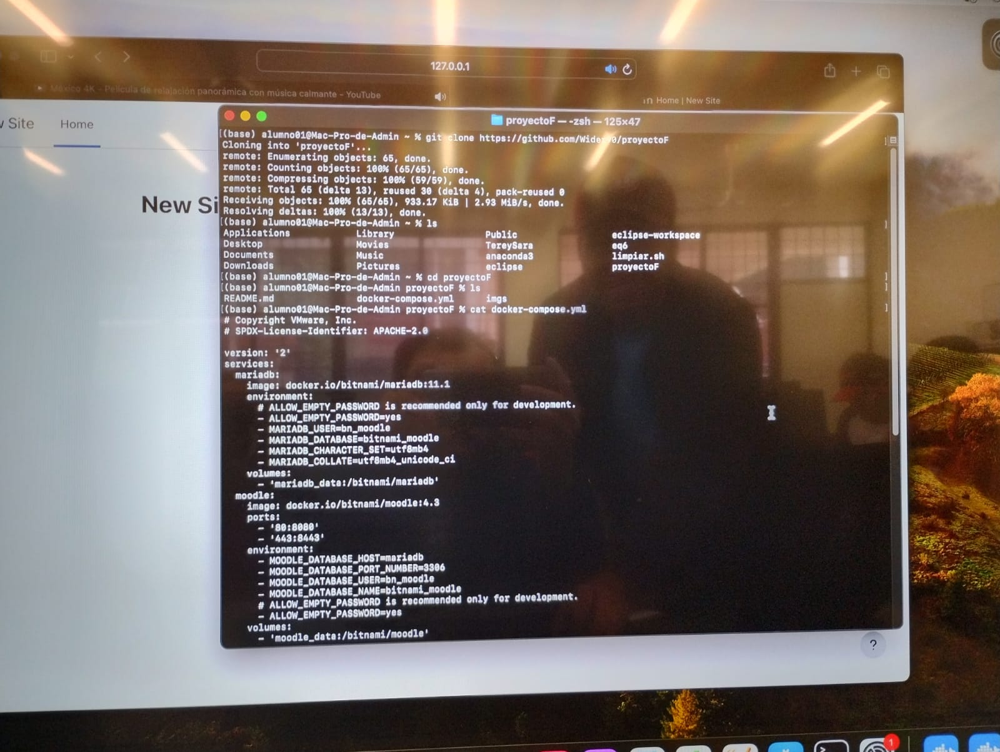
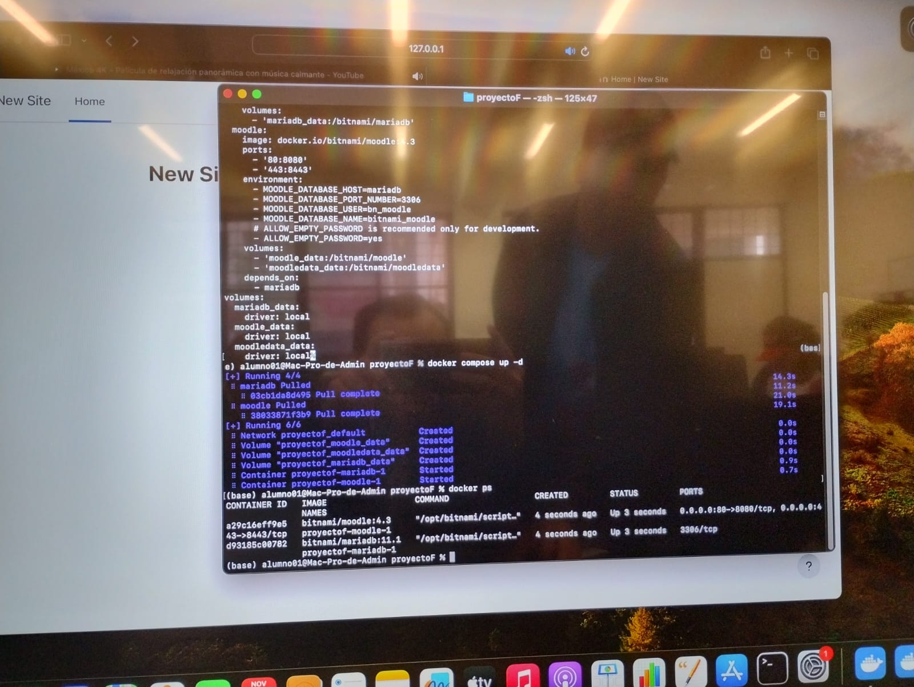
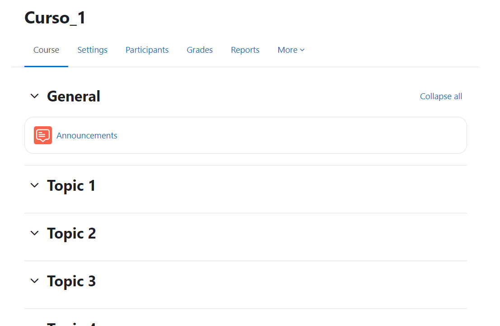
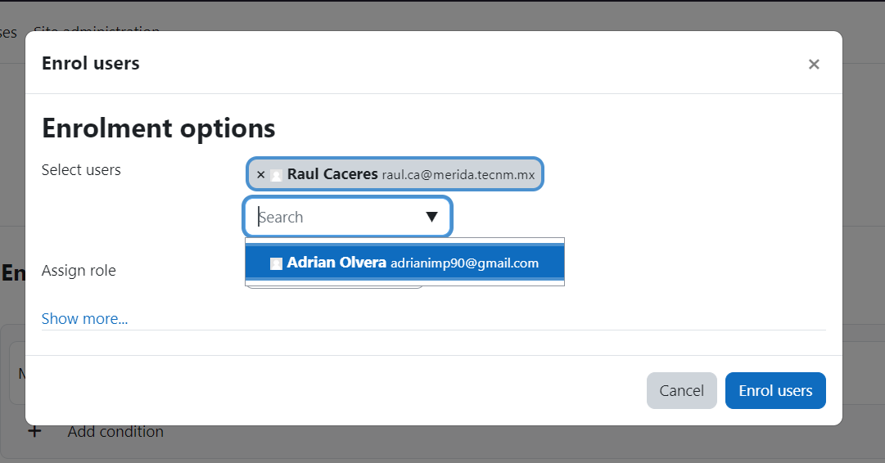
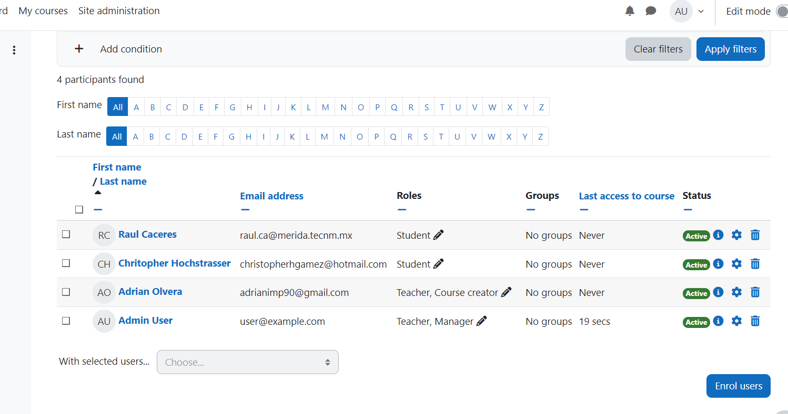

# Responder las preguntas a cerca de la Mac

## 1.- ¿Qué modelo de Mac?
MAC PRO 2019
## 2.-¿Cuánta memoria RAM tiene?
96GB  2666MHz DDR4
## 3.- ¿Qué procesador tiene?
3.5 GHz Intel Xeon W
## 4.- ¿Cuántos núcleos tiene?
8 nucleos
## 5.- ¿Cuántos hilos de ejecución tiene?
16 hilos
## 6.- ¿Qué tarjeta(s) de video tiene?
AMD Radeon Pro W5500X 8GB

# Descargar la imagen del moodle que se encuentra en el docker compose:

## Posteriormente vamos a revisar el documento y una vez que todo se encuentre en orden vamos a usar el comando docker compose up -d

## Una vez que el contenedor termine de levantarse usaremos el comando docker ps para revisar que se encuentre activo y enq ue puerto se encuentra este. Ya con esta información podremos abrir la pagina en nuestor navegador.

# Instalar MOODLE y creacion de un curso

## Moodle
- Instalación con docker-compose 

## Usuarios y Contraseñas que se deben cambiar en el archivo docker-compose.yml
- ALLOW_EMPTY_PASSWORD: YES
- MARIADB_PASSWORD: password
- MOODLE_DATABASE_PASSWORD: password
- MOODLE_USERNAME: user
- MOODLE_PASSWORD: bitnami

### Correr localmente usando docker

1. Clonar el repositorio al directorio local de instalación
git clone https://github.com/Wider90/proyectoF.git

2. Para correr los contenedores

$cd proyectoF

$docker compose up

3. Para detener los contenedores

$docker compose down

### Paso 1) Correr MOODLE 

- http://localhost:8000/

### Paso 2)Login 

- Presionar el botón de Log In e introducir las credenciales de administradr:
- Usuario: user
- Contraseña: bitnami

-Con esto nos debe aparecer la siguiente pantalla

### Paso 3) Creación de un curso

- Para la creación de un curso necesitamos dirigirnos al menú site administration.

- Posteriormente ir al submenu Courses y dar click en Add a new course

-Se nos va a desplegar un formulario que lo llenaremos con la información de nuestro curso

-Por ultimo vamos clickear el botón desplegar e iremos al menú "Mis cursos"

### Paso 4) Inscribirnos al curso

- Lo primero sera entrar a nuestro curso

  
- Vamos ir al menu particpantes

- Ahora vamos a dar click en el botón enrol users

-Agregamos a los usuarios y clickeamos enrol users y podremos ver como fueron agregados los participantes.

