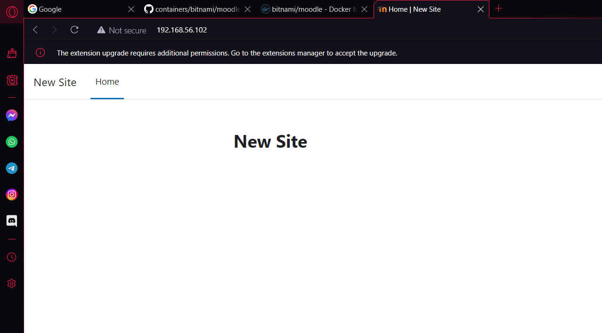
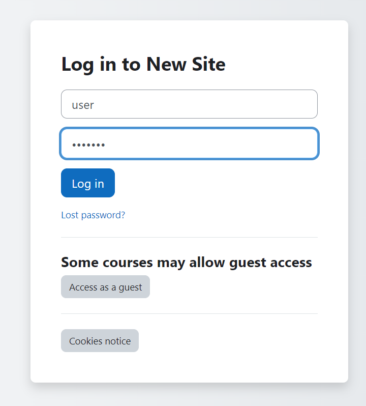
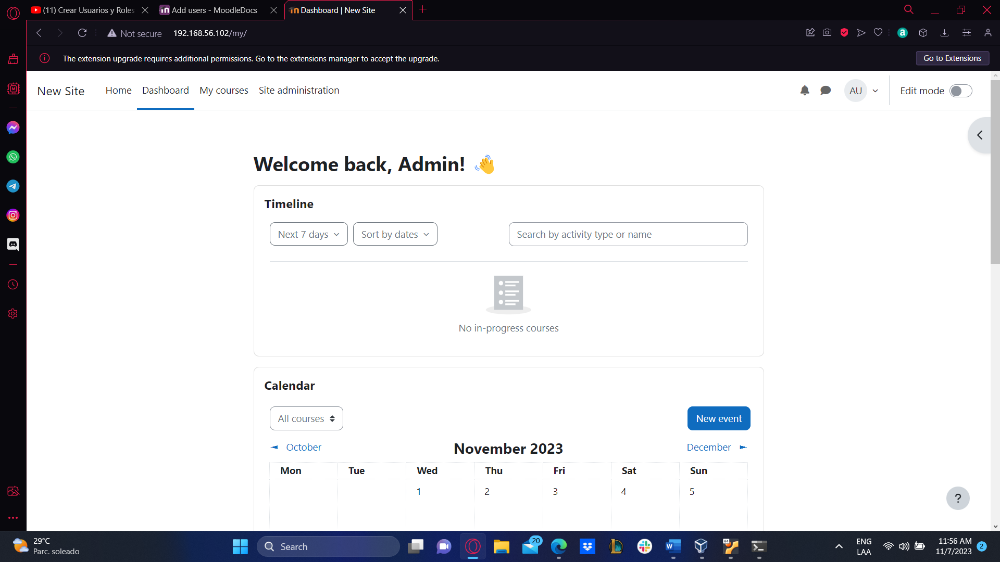
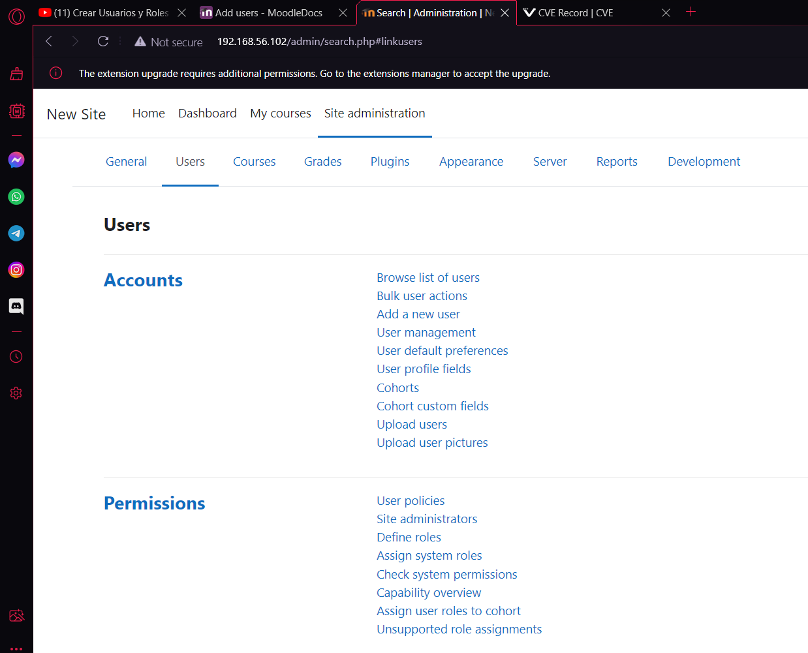
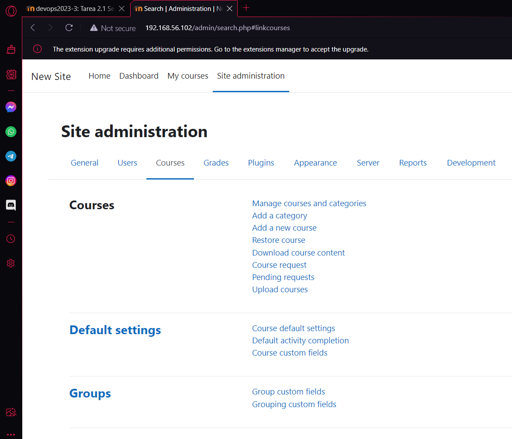
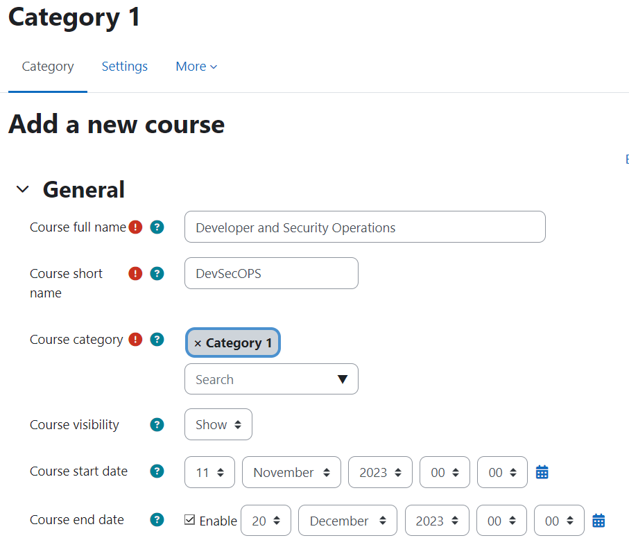
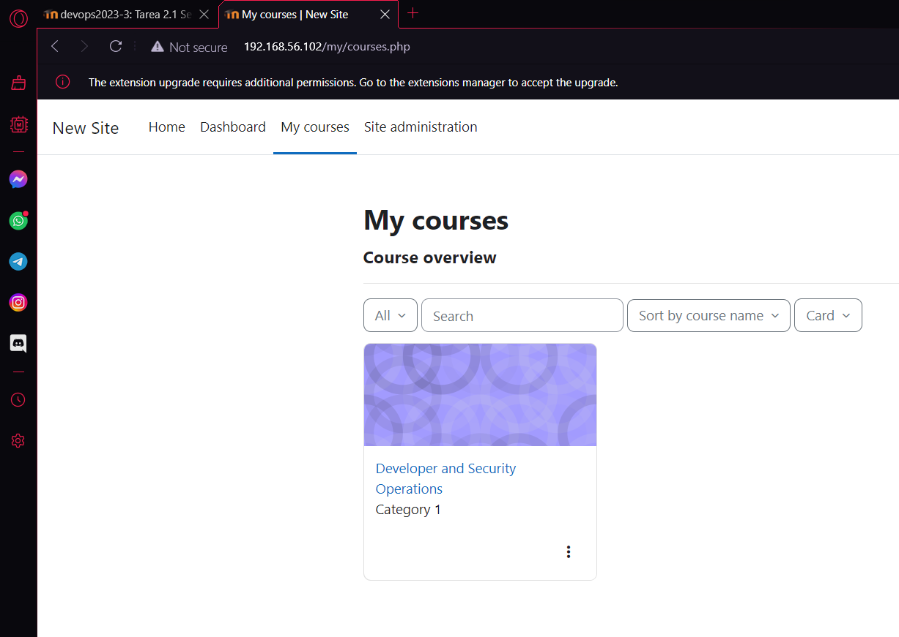
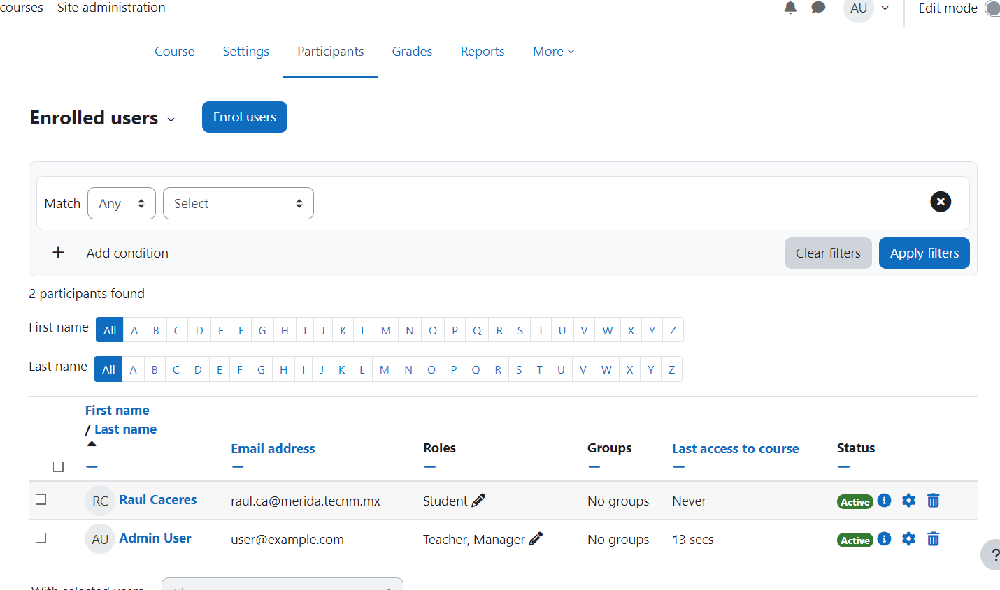

# Instalar MOODLE y creacion de un curso

## Moodle
- Instalación con docker-compose 

## Usuarios y Contraseñas que se deben cambiar en el archivo docker-compose.yml
- MYSQL_ROOT_PASSWORD: password
- MYSQL_PASSWORD: wordpress

### Correr localmente usando docker

1. Clonar el repositorio al directorio local de instalación
git clone https://github.com/Wider90/proyectoF.git

2. Para correr los contenedores

$cd proyectoF

$docker compose up

3. Para detener los contenedores

$docker compose down

# Paso 1) Correr MOODLE 

- http://localhost:8000/
- 

# Paso 2)Login 

- Presionar el botón de Log In e introducir las credenciales de administradr:
- Usuario: user
- Contraseña: bitnami

-Con esto nos debe aparecer la siguiente pantalla

# Paso 3) Creación de un curso

- Para la creación de un curso necesitamos dirigirnos al menú site administration.

- Posteriormente ir al submenu Courses y dar click en Add a new course

-Se nos va a desplegar un formulario que lo llenaremos con la información de nuestro curso

-Por ultimo vamos clickear el botón desplegar e iremos al menú "Mis cursos"

# Paso 4) Inscribirnos al curso

- Lo primero sera entrar a nuestro curso

  
- Vamos ir al menu particpantes

- Ahora vamos a dar click en el botón enrol users

-Agregamos a los usuarios y clickeamos enrol users y podremos ver como fueron agregados los participantes.

